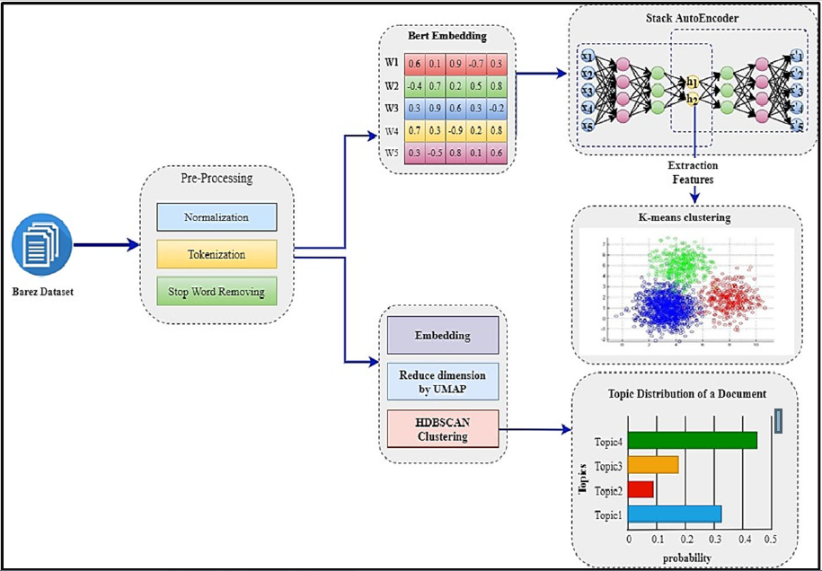

# Deep-text-clustering
## Deep text clustering using stacked Autoencoder
This repository contains the PDF and codes for the our paper ["Deep text clustering using stacked AutoEncoder"](https://link.springer.com/article/10.1007/s11042-022-12155-0)

## Abstract
<p align="justify">Text data is a type of unstructured information, that is easily processed by a human, but
it is hard for the computer to understand. Text mining techniques effectively discover
meaningful information from text, which has received a great deal of attention in recent
years. The aim of this study is to evaluate and analyze the comments and suggestions
presented by Barez Iran Company. Barez is an unlabeled dataset. Extracting useful
information from unlabeled large textual data by humans to manually be very difficult
and time consuming. Therefore, in this paper, we analyze suggestions presented in Persian
using BERTopic modeling for cluster analysis of the dataset. In BERTopic, each
document belongs to a topic with a probability distribution. As a result, seven latent
topics are found, covering a broad range of issues such as Installation, manufacture,
correction, and device. Then we propose a novel deep text clustering based on a hybrid of a
stacked autoencoder and k-means clustering to organize text documents into meaningful
groups for mining information from Barez data in an unsupervised method. Our data
clustering has three main steps: 1) Text representation with a new pre-trained BERT
model for language understanding called ParsBERT, 2) Text feature extraction based on
based on a new architecture of stacked autoencoder to reduce the dimension of data to
provide robust features for clustering, 3) Cluster the data by k-means clustering. We
employ the Barez dataset to verify our work’s effectiveness; the Silhouette Score is used to
evaluate the resulting clusters with the best value of 0.60 with 3 clusters grouping.
Experimental evaluations demonstrate that the proposed algorithm clearly outperforms
other clustering methods.</p>

The schematic of the proposed method in our paper is shown below:


## Contributing
Contributions to this repository are welcome! Feel free to fork the repository and submit pull requests for enhancements, optimizations, or extensions.

## Citation

```
@article{
  title={Deep text clustering using stacked AutoEncoder},
  author={Hosseini Soodeh and Asghari Varzaneh, Zahra},
  journal={Multimedia Tools and Applications},
  year={2022}
}


